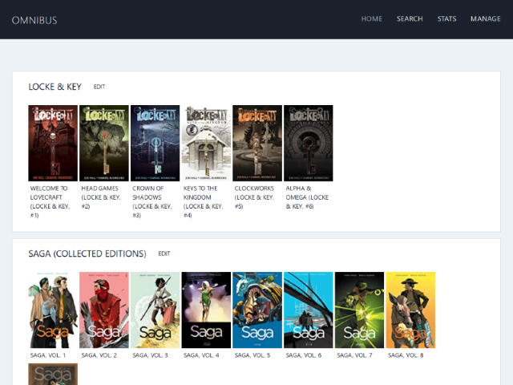

# Omnibus

**Omnibus** is a simple web application for tracking comic book collections. It is built using [Django](https://www.djangoproject.com/) and backed by the [Goodreads API](https://www.goodreads.com/api/).

<div style="padding: 1rem 0; text-align: center">
  <a href="assets/omnibus_home.png">
    
  </a>
</div>

**Omnibus** is made possible by the following packages:  
[Django](https://github.com/django/django) | [django-apscheduler](https://github.com/jarekwg/django-apscheduler) | [django-webpack-loader](https://github.com/owais/django-webpack-loader) | [httpx](https://github.com/encode/httpx) | [Jinja2](https://github.com/pallets/jinja) | [marshmallow](https://github.com/marshmallow-code/marshmallow) | [xmltodict](https://github.com/martinblech/xmltodict)

- - -

## Quickstart

```bash
$ # Check out repository and move into it
$ git clone https://github.com/jessebraham/omnibus.git
$ cd omnibus
# Create and activate a virtual environment, install requirements
$ python -m venv .venv
$ source .venv/bin/activate
$ pip install -r requirements.txt
# Install required NPM packages, build static assets
$ npm i && npm run dev
```

The `GOODREADS_API_KEY` and `GOODREADS_USER_ID` environment variables should be set prior to running the application. While the application will still load and function for the most part, the search and sync features will not work without these set.

More information regarding your API key can be found [in the Goodreads docs](https://www.goodreads.com/api/keys), and your User ID can be found by navigating to your Goodreads profile and extracting the numeric portion of the URL.

```bash
$ export GOODREADS_API_KEY="[your-api-key]"
$ export GOODREADS_USER_ID="[your-user-id]"
```

With the environment variables set, perform the database migrations, and run the application:

```bash
$ python manage.py migrate
$ python manage.py runserver
```

Navigate to `http://localhost:8000` in your browser to begin.

## Production

In order to run the application in production mode, a handful more environment variables are required. An `.env` file can be created in the project root directory containing the values, and the environment variables can then be set by running `source .env` in a terminal.

```bash
# Set the API key and user ID for goodreads.
export GOODREADS_API_KEY=""
export GOODREADS_USER_ID=""

# Be sure to set a strong, randomized secret key for Django.
export SECRET_KEY=""

# More information on DATABASE_URL formatting can be found at:
# https://github.com/jacobian/dj-database-url#url-schema
export DATABASE_URL=""

# ALLOWED_HOSTS should be a string containing either a single host,
# or a comma-separated list of hosts. Defaults to 'localhost' if this
# variable is not set.
export ALLOWED_HOSTS=""

# Timezone and Goodreads sync interval can optionally be modified as
# well. By default, the timezone is UTC and the sync interval is 24
# hours. Sync interval should be provided in seconds.
export TIME_ZONE=""
export SYNC_INTERVAL=""
```

Additionally, you should ensure that the CSS and JS have been built in production mode to minimize bundle size, and that the static files have been collected.

```bash
$ npm run prod
$ python manage.py collectstatic
```

## Docker

If deploying using [Docker](https://www.docker.com/) you can use the sample `docker-compose.yml` seen below; this file must be present in the root project directory. Be sure to update all environment variables prior to running.

```yaml
version '2'

services:
  omnibus:
    build: .
    image: omnibus:latest
    restart: always
    environment:
      ALLOWED_HOSTS: ''
      DATABASE_URL: ''
      GOODREADS_API_KEY: ''
      GOODREADS_USER_ID: ''
      SECRET_KEY: ''
    ports:
      - 8000:8000/tcp
```

- - -

## To Do

- [ ] Write a reasonable amount of tests
- [ ] Sync changes in a book's read status and/or rating back to Goodreads when updated
- [ ] Add some graphs and/or other interesting metrics to stats page
- [ ] Improve syncing speed (parallel requests?)
